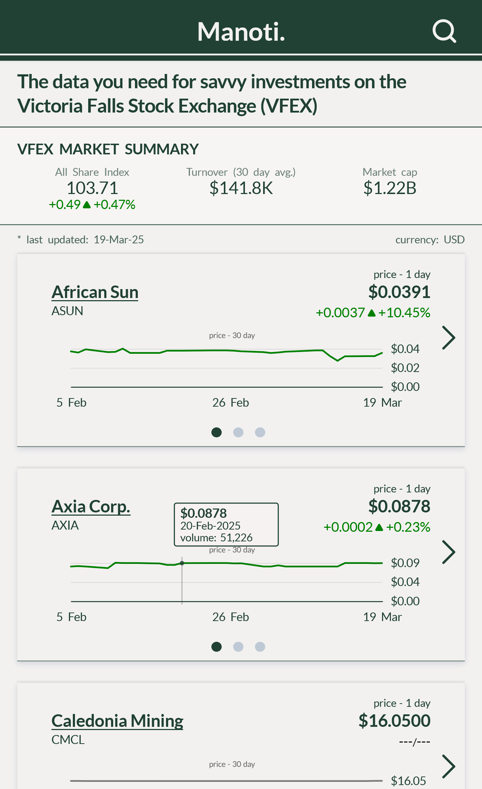

# My first Fullstack Project 🥂

go to (https://www.manoti.co) to access a live version of this website

### Mobile view:

## Technologies used:
  -vanilla JTML
  -vanilla CSS
  -vanilla JS
  -NodeJS
  -ExpressJS
  -D3.JS
  -JSDOM

The project is hosted on a VPS on digital ocean.

## Technologies used on VPS:
  -MySQL server
  -Ngninx
  -pm2
  -Let's Encrypt SSL

### Desktop view:

